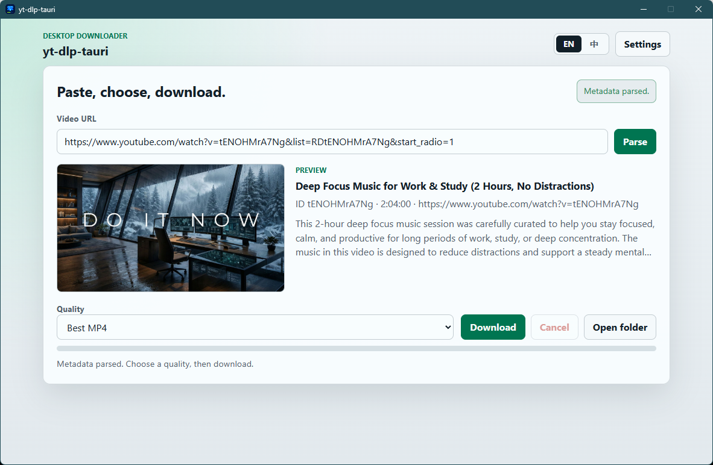

<h1 align="center">yt-dlp-tauri</h1>

<p align="center">
  <strong>A minimal Windows/macOS desktop downloader powered by yt-dlp and Tauri 2.</strong>
</p>

<p align="center">
  <a href="./README_zh.md">中文</a> ·
  <a href="#quick-start">Quick Start</a> ·
  <a href="#configuration">Configuration</a> ·
  <a href="#verification">Verification</a> ·
  <a href="#documentation">Documentation</a>
</p>

<p align="center">
  
  
  
  
  
</p>

<p align="center">
  
</p>

---

## What is yt-dlp-tauri?

`yt-dlp-tauri` is a small desktop app for downloading videos with `yt-dlp` without writing command-line options by hand. Paste a video URL from a [site supported by yt-dlp](https://github.com/yt-dlp/yt-dlp/blob/master/supportedsites.md), preview the metadata, choose a quality, and download an MP4-friendly file from a focused desktop UI.

The project is desktop-first and local-first. It is not a hosted downloader service, does not provide multi-user accounts, and is not affiliated with `yt-dlp`, FFmpeg, Deno, or Tauri.

## Features

- Parse video metadata through `yt-dlp` and preview title, thumbnail, duration, source URL, description, and quality options.
- Download with live progress, speed, ETA, cancellation, and a saved output folder.
- Use Cookie files for authenticated sites, including Netscape `cookies.txt` and one-line browser Cookie headers.
- Install, update, reinstall, and verify the app-managed platform toolchain from Settings.
- Verify tools against fixed source URLs and SHA-256 hashes from a pinned manifest.
- Switch the UI between English and Chinese.
- Check GitHub Releases for app updates, with optional `gh-proxy` routing for update and release access.
- Keep local operational logs for recent app activity.

## Tech Stack

| Layer | Choice |
| --- | --- |
| Desktop runtime | Tauri 2 |
| Backend | Rust |
| Frontend | Vanilla TypeScript, Vite |
| UI | Fixed-size product-style desktop interface |
| Toolchain | App-managed Windows/macOS `yt-dlp`, `ffmpeg`, `ffprobe`, `deno` |
| Installer | Windows NSIS, macOS DMG |

## Quick Start

Use Windows or macOS for real app builds. WSL can run many checks, but release installers should be built on their target OS or by the GitHub Actions release workflow.

### 1. Install prerequisites

- Windows 10/11 with WebView2 Runtime, or macOS
- Node.js 24+
- Rust stable with the platform toolchain
- PowerShell 5+ or PowerShell 7+ on Windows

### 2. Install dependencies

```powershell
npm ci
```

### 3. Optional: restore development tools

```powershell
.\scripts\download-tools.ps1
```

This is optional for normal app use. If tools are missing, open the app, go to Settings, and click `Install tools`.

### 4. Run the desktop app in development

```powershell
npm run tauri dev
```

### 5. Build the desktop installer

```powershell
npm run tauri build
```

The configured bundle targets are `nsis` and `dmg`. Build output is written under platform-specific bundle directories such as:

```text
src-tauri\target\release\bundle\nsis\
src-tauri/target/release/bundle/dmg/
```

## Configuration

| Item | Purpose |
| --- | --- |
| `toolchain-policy.json` | Reviewed upstream sources, version-selection rules, targets, and allowed hosts. |
| `toolchain-lock.json` | Generated immutable release metadata and archive/executable SHA-256 hashes. |
| `src-tauri/tools-manifest.json` | Generated runtime tool versions, fixed source URLs, target names, and executable hashes. |
| `TOOLCHAIN_CHANGELOG.md` | Tool-only revision history, independent from application releases. |
| `src-tauri/tauri.conf.json` | Tauri app metadata, fixed window size, bundle target, icons, and resources. |
| `scripts/download-tools.ps1` | Optional development script that restores the pinned `win-x64` toolchain into the checkout. |
| Settings: output folder | User-facing download directory selection, save, reset, and open actions. |
| Settings: GitHub site | `Direct` or `gh-proxy` mode for update checks and release links. Project home always opens GitHub directly. |

Current release scope:

- Populated tool targets: `win-x64`, `macos-x64`, `macos-arm64`.
- Planned manifest target: `win-arm64`, once every tool URL and hash is pinned.
- Tool binaries are not committed to the repository.

## Toolchain Maintenance

The `Toolchain Discovery` workflow resolves yt-dlp, Deno, FFmpeg, and FFprobe once per week and maintains one reviewed `bot/toolchain-weekly` pull request. `Toolchain Freshness` checks released source URLs daily and opens a focused emergency pull request for an affected source. Both workflows require human review before merge.

The unified resolver can be inspected locally without changing files:

```bash
GITHUB_TOKEN="$(gh auth token)" node scripts/update-toolchain.mjs --dry-run
```

Source and selection changes belong in `toolchain-policy.json`. The resolver generates the lock, runtime manifest, and toolchain changelog together.

## Data, Storage, and Output

Downloaded videos default to:

```text
%USERPROFILE%\Downloads\yt-dlp-tauri\
```

App state and logs are stored under:

```text
%LOCALAPPDATA%\yt-dlp-tauri\state\
%LOCALAPPDATA%\yt-dlp-tauri\logs\app.log
```

Installed app tools are written under:

```text
%LOCALAPPDATA%\yt-dlp-tauri\Tools\win-x64\
```

Development checkout tools can live at:

```text
src-tauri\Tools\win-x64\yt-dlp\yt-dlp.exe
src-tauri\Tools\win-x64\ffmpeg\bin\ffmpeg.exe
src-tauri\Tools\win-x64\ffmpeg\bin\ffprobe.exe
src-tauri\Tools\win-x64\deno\deno.exe
```

## Verification

Frontend tests:

```powershell
npm test
```

Frontend build:

```powershell
npm run build
```

Rust backend tests:

```powershell
cargo test --manifest-path .\src-tauri\Cargo.toml --lib
```

Rust backend check:

```powershell
cargo check --manifest-path .\src-tauri\Cargo.toml
```

Full Tauri build:

```powershell
npm run tauri build
```

## Documentation

- [Changelog](./CHANGELOG.md)
- [Contributing](./CONTRIBUTING.md)
- [Security policy](./SECURITY.md)
- [Third-party notices](./THIRD-PARTY-NOTICES.md)
- [Toolchain policy](./toolchain-policy.json)
- [Toolchain changelog](./TOOLCHAIN_CHANGELOG.md)
- [Tool manifest](./src-tauri/tools-manifest.json)

## Star History

<a href="https://www.star-history.com/?repos=Chlience%2Fyt-dlp-tauri&type=date&legend=top-left">
 <picture>
   <source media="(prefers-color-scheme: dark)" srcset="https://api.star-history.com/chart?repos=Chlience/yt-dlp-tauri&type=date&theme=dark&legend=top-left" />
   <source media="(prefers-color-scheme: light)" srcset="https://api.star-history.com/chart?repos=Chlience/yt-dlp-tauri&type=date&legend=top-left" />
   
 </picture>
</a>

## Release Checklist

Before publishing a release:

1. Run the verification commands above.
2. Push a version tag such as `v0.1.3`.
3. Wait for the `Release` workflow to upload Windows NSIS, macOS DMG, and `tools-manifest.json` artifacts to the draft GitHub Release.
4. Confirm `src-tauri/tools-manifest.json` uses fixed release URLs, not `latest`.
5. Confirm generated folders and restored tools are not staged.
6. Include the GPL license and third-party notices with the release.

## Legal

This project is licensed under GPL-3.0. The app downloads and uses third-party command-line tools with their own licenses and redistribution obligations. See [THIRD-PARTY-NOTICES.md](./THIRD-PARTY-NOTICES.md).

This project is not affiliated with `yt-dlp`, FFmpeg, Deno, or Tauri.
